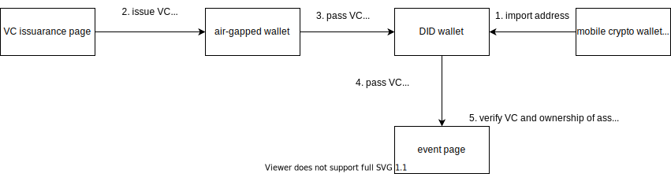

# DevCon Bounty AirGapped Asset Verification

This bounty is a challenge to verify the ownership of one's asset *in their air-gapped wallet*, with a less critical mobile wallet at a event requiring that condition to participants. Our approach here is unique in terms of 1) use of *DID/VC* (decentralized identity/verifiable creadential) technology to prove ownership, 2) use of *WalletConnect* to sign with the air-gapped wallet, 3) no smart contract implementation.

A participant of the event issues a VC before the event to proves the ownership of asset has been delegated to an address of their hot wallet and that asset is actually owned by an address of the air-gapped wallet. He/She sends it to their DID wallet in their mobile phone they intend to bring to the event. At the event they connect to an app of the event and present the VC to verify their ownership of asset.

Benefits of this approach include reducing the exposure area of the air-gapped wallet. No payment occured, privacy-respecting, easy to maek it interoperable to other chains in the future.

## How It Works



[SCREENSHOTS.md](./SCREENSHOTS.md) is also informative.

## Environment

We tested the mobile app on iOS.
We assume the ledger network is Ethereum mainnet and haven't test it on any testnet.

## Step

For visual explanation please go to [SCREENSHOTS.md](./SCREENSHOTS.md).

1. Decide which address to use for which app
    1. We suggest to use arbitrary ones for the DID wallet and the event organizer, and one owning some of your NFTs for the air-gapped wallet.
1. edit environment variables on `DevConBountyAirGappedWallet/.env`, `event-site/.env`. Addresses chosen above should be written these files.
1. run `yarn install` on each directories: i.e. `cd event-site; yarn install; cd ../try-wallet-connect/; yarn install; cd ../DevConBountyAirGappedWallet; cd ..`
1. run `bundle exec pod install` on the `DevConBountyAirGappedWallet/ios` directory
1. run all apps. the commands are below.

```console
cd event-site
yarn start
# another terminal
cd try-wallet-connect
yarn start # type 'y' to the next prompt
# another terminal
cd DevConBountyAirGappedWallet # this is not an air-gapped wallet but a DID wallet
yarn ios # your physical device to scan QR codes
```

## Notable technologies We Use

- EIP-712 `eth_signTypedData` JSON RPC: <https://eips.ethereum.org/EIPS/eip-712>
- Ethereum EIP712 Signature 2021: <https://w3c-ccg.github.io/ethereum-eip712-signature-2021-spec/>
  - I was inspired by <https://energy-web-foundation.gitbook.io/energy-web/identity-at-ew/patterns/credentials>
- WalletConnect
- DID/VC
- Self-Issued OpenID Provider: <https://openid.net/specs/openid-connect-self-issued-v2-1_0.html#name-cross-device-self-issued-op>
- `did:ethr` DID Method
- React Native
- ERC721: <http://erc721.org/>
