# Screenshots

Click "connect" to start demo. This is the app in `try-wallet-connect` directory.

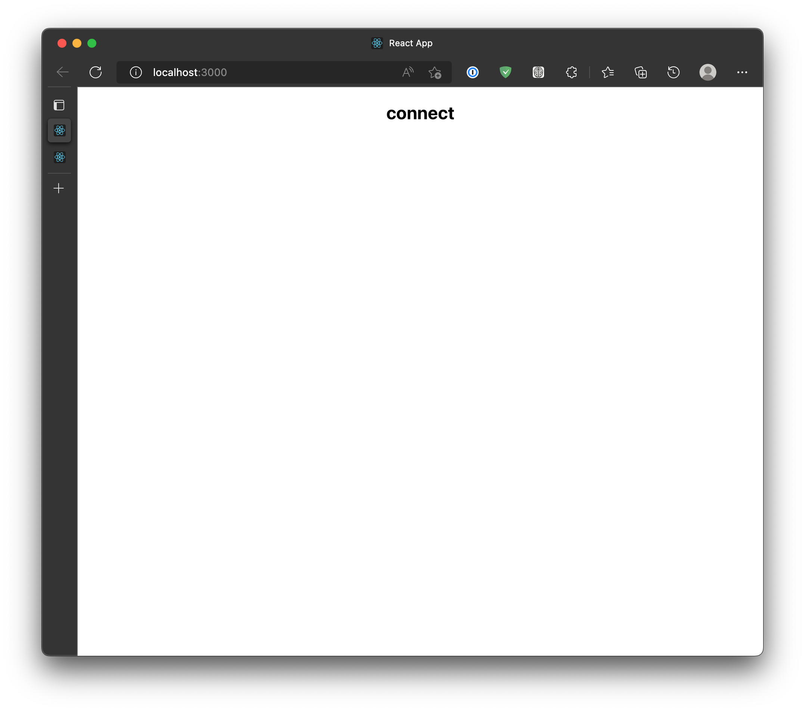

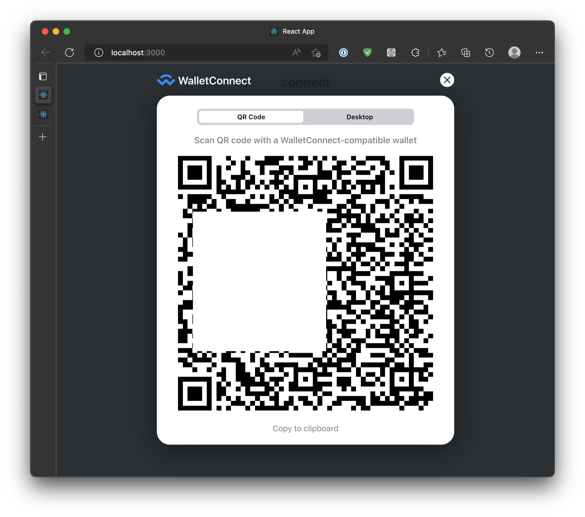

Scan the above QR Code with the crypto wallet's camera. then you confirm connection.
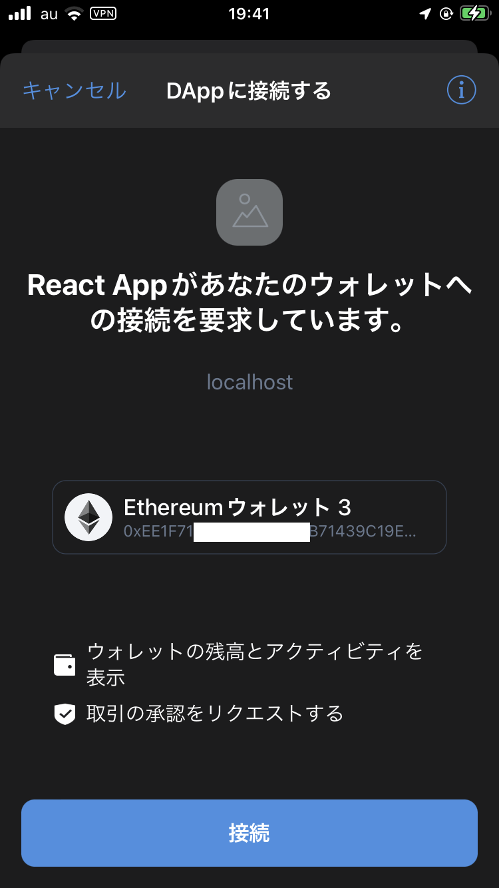

Connection is established. Let's create a credential (VC). To do so you need to fill the form on the page.

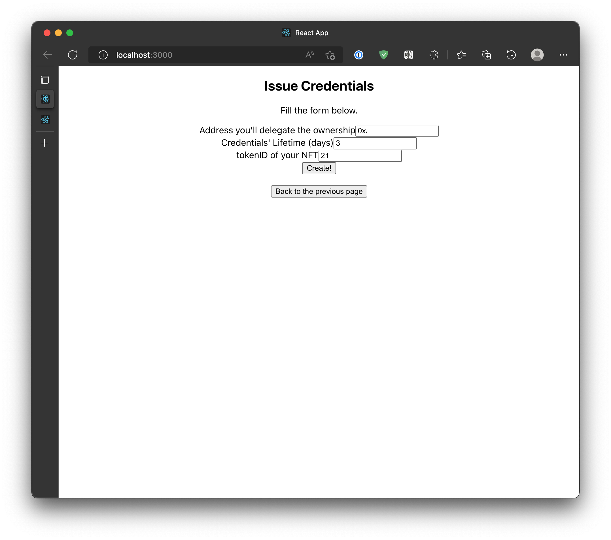

When you click "create!", your crypto wallet ask you confirmation again.

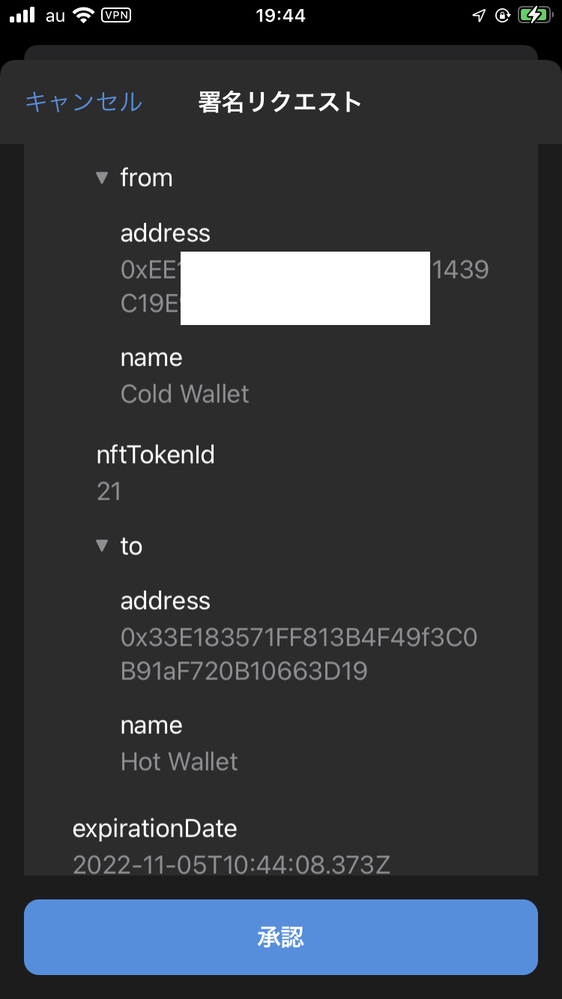

Then this code appears in the page. This one needs to be scaned by the mobile phone's camera app.

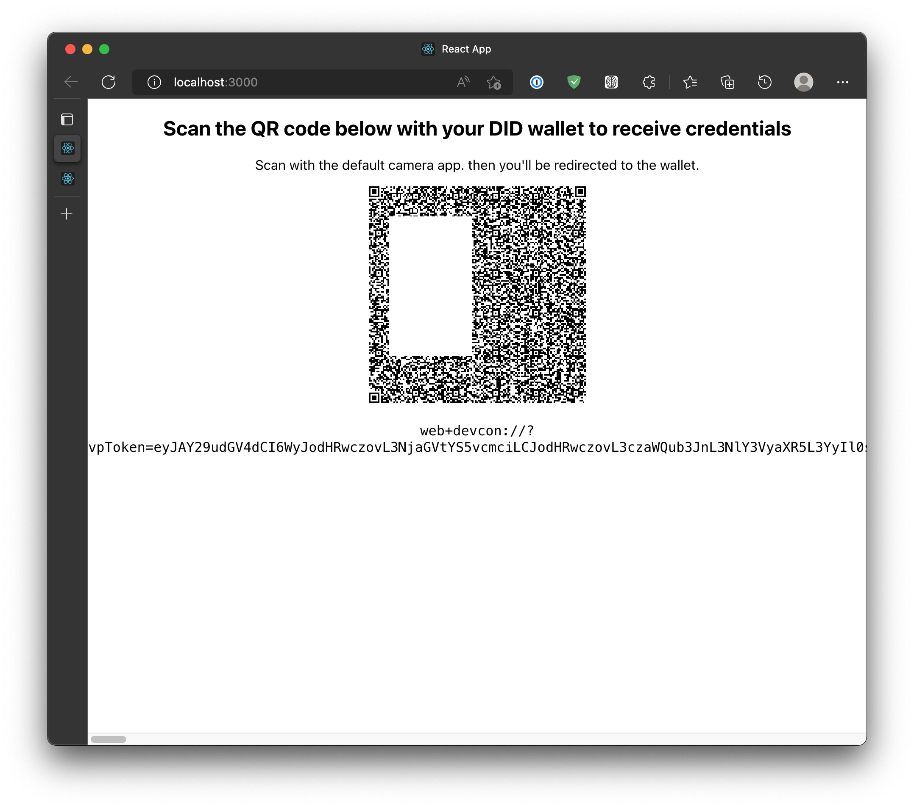

Then you're redirected to the DID wallet app we've created.

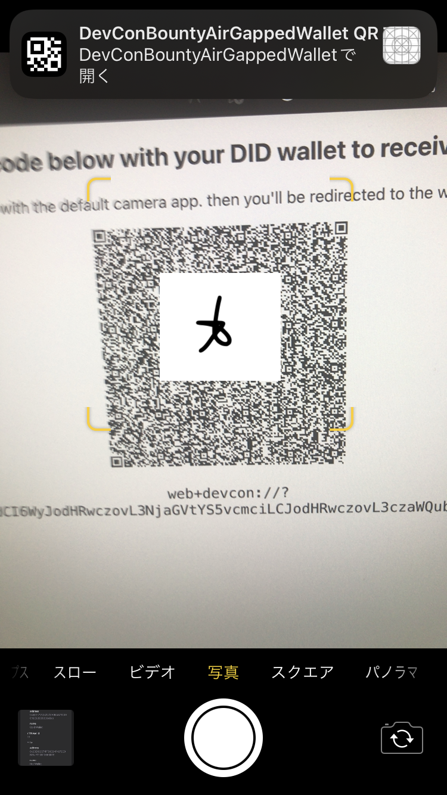

You've received the credential. Nothing happens in this screen. Go to the next step.

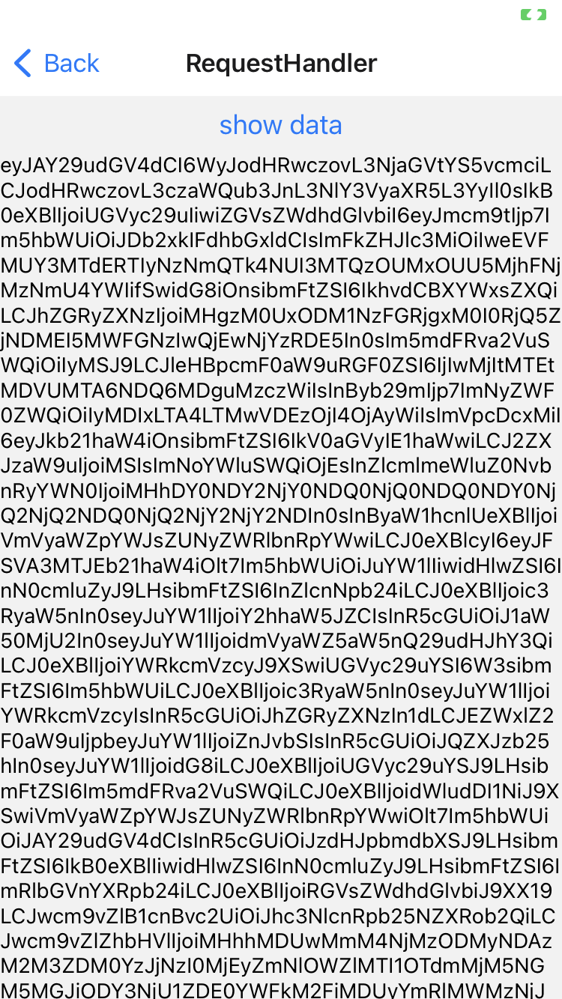

Scan this code with your mobile phone. This is the app in the `event-site` directory.

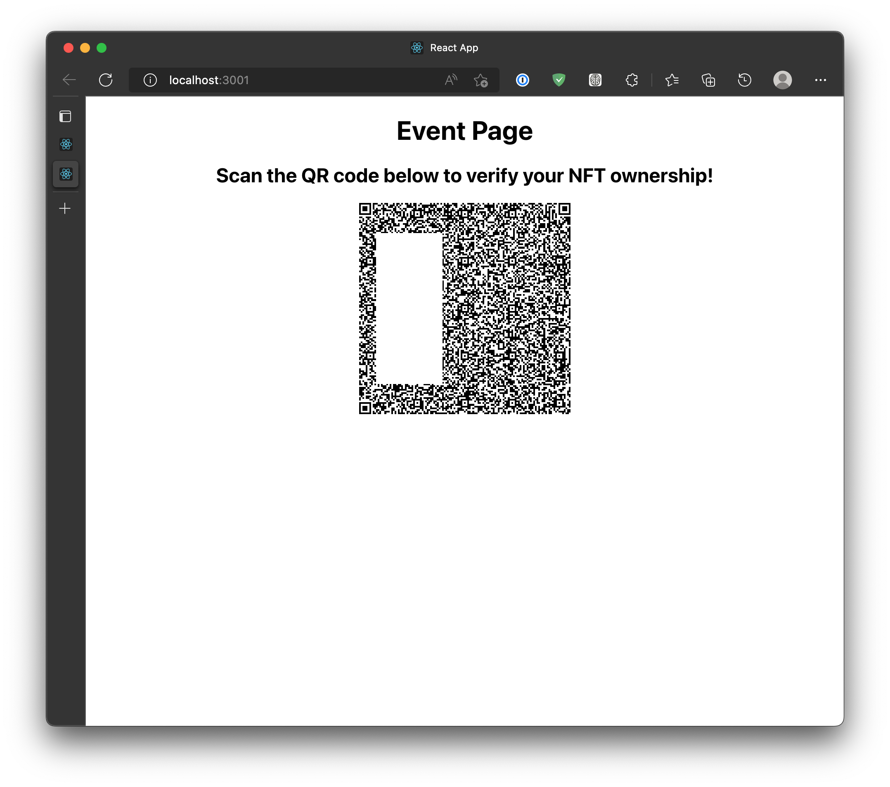

Scan it.

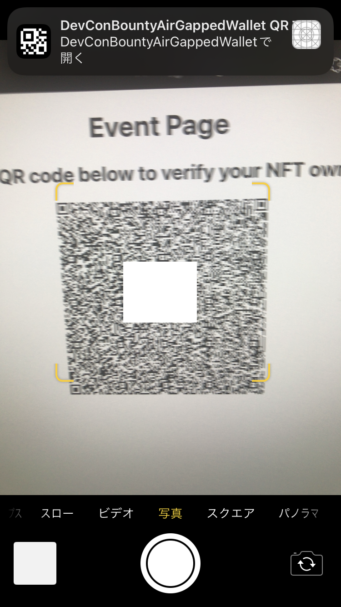

That is a SIOP Request so that we're asked sign-in confirmation. Credentials are passed as additional values of sign-in response.

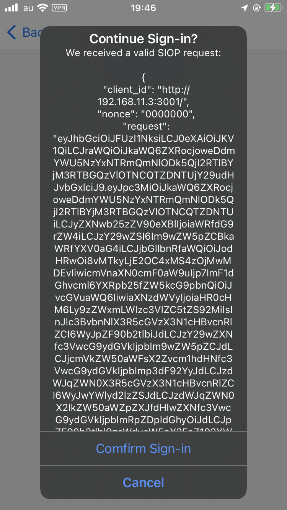

If you confirmed that you'll be redirected to the event page. If all verification passes, the green message shows up!

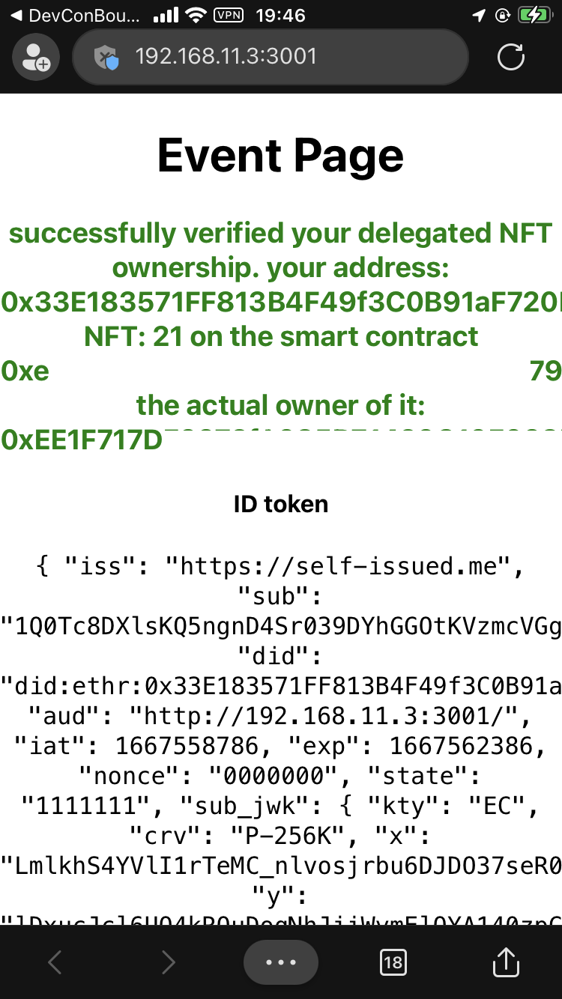
